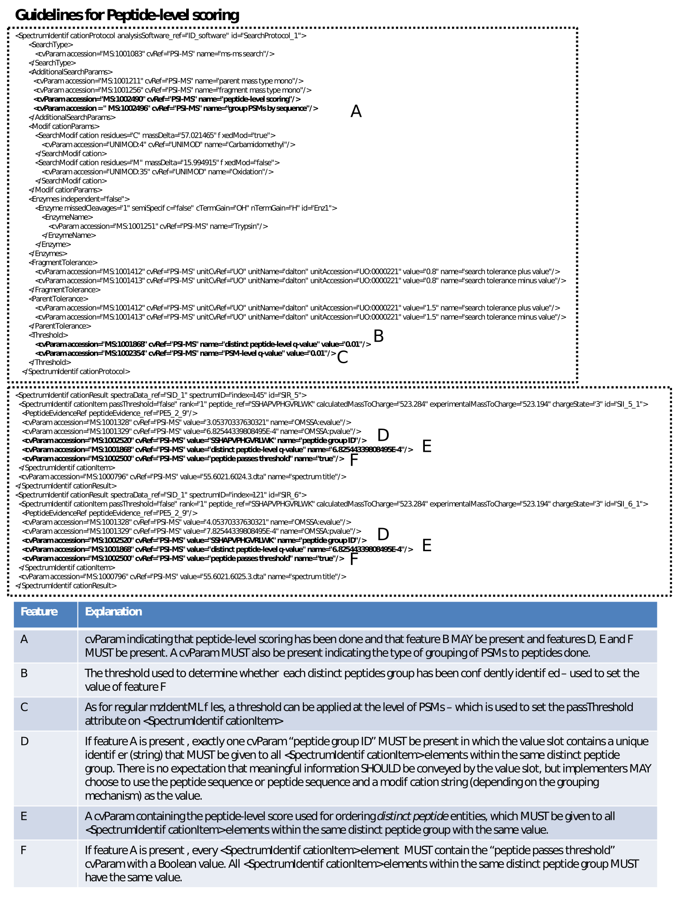
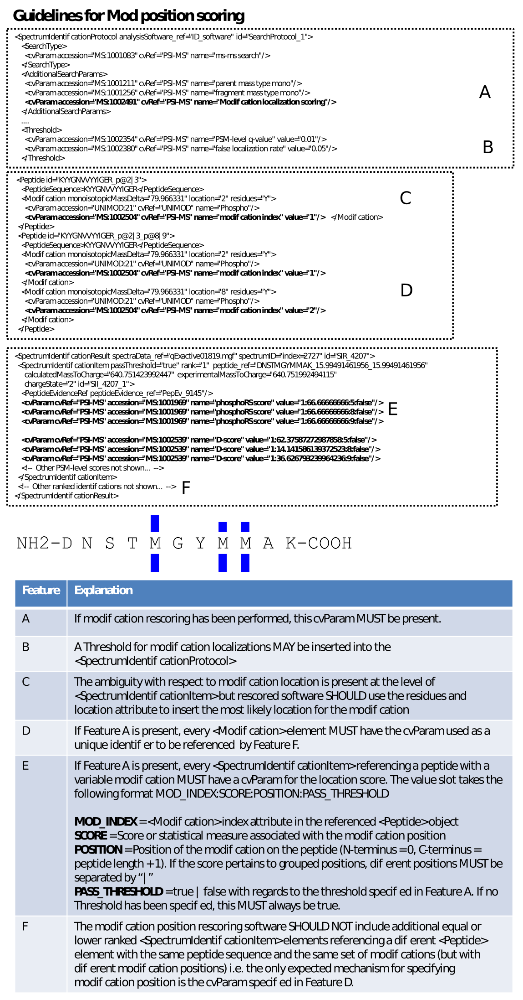
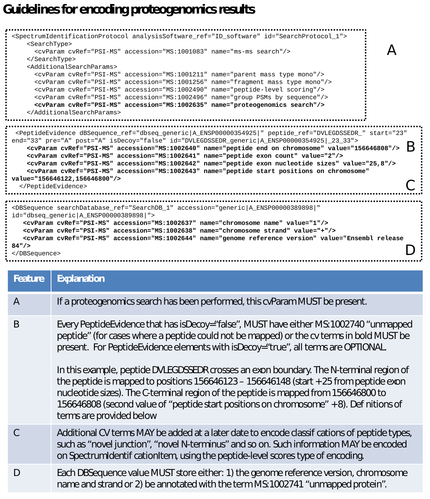

[[mzidentml:-exchange-format-for-peptides-and-proteins-identified-from-mass-spectra]]
= mzIdentML: exchange format for peptides and proteins identified from mass spectra
:source-highlighter: pygments
//:pygments-style: colorful
:pygments-style: murphy
:toc: left
:doctype: book
//only works on some backends, not HTML
:showcomments:
//use style like Section 1 when referencing within the document.
:xrefstyle: short
:figure-caption: Figure
:pdf-page-size: A4

//GitHub specific settings
ifdef::env-github[]
:tip-caption: :bulb:
:note-caption: :information_source:
:important-caption: :heavy_exclamation_mark:
:caution-caption: :fire:
:warning-caption: :warning:
endif::[]

:commit-hash: UNDEFINED
:build-date: UNDEFINED
:document-version: version 1.3.0 final, June 2024

//disable section numbering
:!sectnums:
[[preface]]
== Preface

_Status of This Document_

This document presents a final specification for the mzIdentML data format developed by the HUPO Proteomics Standards Initiative.
Distribution is unlimited.

_Version of This Document_

Date created: June 24, 2024

Last updated: {build-date}

Based on commit: https://github.com/HUPO-PSI/mzTab/commit/{commit-hash}[{commit-hash}] - https://github.com/HUPO-PSI/mzTab/commits/master/specification_document-releases/2_0-Metabolomics-Release/mzTab_format_specification_2_0-M_release.adoc[Commit History]

The current version of this document is: {document-version}

The latest (draft) version of this document may be found at https://github.com/HUPO-PSI/mzTab.

_Type of This Document_

This document is a _recommendation_ for a common, community-driven standard data exchange format in proteomics.

_Authors_

Please see <<authors-and-contributors>> for details on the authors and editors of this document.

[[abstract]]
== Abstract

The Human Proteome Organisation (HUPO) Proteomics Standards Initiative (PSI) defines community standards for data representation in proteomics to facilitate data comparison, exchange and verification.
The Proteomics Informatics Working Group is developing standards for describing the results of identification and quantitation processes for proteins, peptides and protein modifications from mass spectrometry.
This document defines an XML schema that can be used to describe the outputs of proteomics search engines or similar software for peptide/protein identification from mass spectrometry (MS) data.

//reenable section numbering
:sectnums:
[[introduction]]
== Introduction

[[background]]
=== Background

This document addresses the systematic description of (poly)peptide identification and characterisation based upon mass spectrometry (MS).
A large number of different proteomics search engines are available that produce output in a variety of different formats.
It is intended that mzIdentML will provide a common standard format for identification results to support a range of scenarios encountered in proteome informatics. mzIdentML has been developed with a view to supporting the following general tasks (more specific use cases are provided in Section 2.):

[arabic]
. _The discovery of relevant results,_ so that, for example, data sets in a database that use a particular technique or combination of techniques can be identified and studied by experimentalists during experiment design or data analysis.
. _The sharing of best practice_, so that, for example, analyses that have been particularly successful at identifying a certain group of peptides/proteins can be interpreted by consumers of the data.
. _The evaluation of results_, so that, for example, sufficient information is provided about how a particular analysis was performed to allow the results to be critically evaluated.
. _The sharing of data sets,_ so that, for example, public repositories can import or export data, or multi-site projects can share results to support integrated analysis.
. _The creation of a format for input to analysis software_, for example, allowing software to be designed that provides a meta-score over the output from several search engines.
. _An internal format for pipeline analysis software, for example, allowing analysis software to store intermediate results from different stages of an identification pipeline, prior to the final results being assembled in a single mzIdentML file._

This document presents a specification, not a tutorial.
As such, the presentation of technical details is deliberately direct.
The role of the text is to describe the model and justify design decisions made.
The document does not discuss how the models should be used in practice, consider tool support for data capture or storage, or provide comprehensive examples of the models in use.
Tutorial material can be located on the PSI website (see http://www.psidev.info/mzidentml).

[[document-structure]]
=== Document Structure

The remainder of this document is structured as follows.
Section 2. lists use cases mzIdentML is designed to support.
Section 3. describes the terminology used.
Section 4. describes how the specification presented in Section 4. relates to other specifications, both those that it extends and those that it is intended to complement.
Section 6. contains the documentation for the XML schema which is generated automatically and several parts of the schema are documented in more detail in Section 7. Conclusions are presented in Section 8..

[[use-cases-for-mzidentml]]
== Use Cases for mzIdentML

The following use cases have driven the development of the mzIdentML data model and XML schema, and are used to define the scope of the format in the current version.

It should be possible to create a tool that loads an mzIdentML document and enables users to examine results from an MS or MSn analysis.
As of mzIdentML version 1.3.0, there is support for aggregating evidence from multiple MS levels by using the encoding for identifications based on multiple spectra given in Section 7.11. There should be sufficient information for the tool to generate output reports that conform to the requirements made by journals for publication and that conform to the relevant MIAPE guidelines.
For example: +
· For a Peptide Mass Fingerprint (PMF) search, it should be possible to display the spectrum and show the matches of the peaks to the relevant peptides. +
· For an MS/MS search, it should be possible to locate which spectrum matched to which peptide in the original file.

[arabic]
. There should be sufficient information stored in the instance document to enable a user to run the same or a similar search on the same or another search engine.
This means that all search parameters should be described in sufficient detail and that sufficient information is available to determine which database (if any) the data were searched against.
The peak lists data do not need to be included in the instance document, but do need to be suitably referenced.
. It should be possible to save the results of searching a decoy database in the same instance document as the results from the target database.
It should then be possible to write a viewer application that enables a user to investigate the effect of changing, for example, a threshold value on the false discovery rate.
This would only be possible if results that are generally considered lower quality from the search are also saved in the mzIdentML document (rather than just top matches) and if the results from the decoy search are also saved.
It would only be possible to do this at the peptide level for an MS/MS search, because changing thresholds would normally have some effect on the protein grouping algorithm.
. It should be possible to save manual or automated annotation of proteins/peptides in an instance document.
A third-party tool could be used to save annotations and validations of identified proteins/peptides to an existing instance document.
. It should be possible to save the results from a search of a metabolically labelled sample.
For example, with a 14N/15N experiment, two separate sets of amino acid masses are used, and it must be possible to tell which masses were used for each peptide result.
. For a search of multiple peak lists, it should be possible to identify the spectrum that matched a particular peptide or protein reported by the search engine.
For example, in an LC-MS/MS run, it should be possible to refer back to the spectrum in the peak list file that was searched and from there, if the information is available, to be able to determine the retention time of the spectrum.
. It should be possible to search a file to retrieve all molecules that have a specified modification.
. It should be possible to store the results of a search of spectra against other spectra – _i.e._, a spectral library search.
. It should be possible to store the results of a top-down search, _i.e._, analysis of complete proteins.
. Support should be provided for storing fragmentation data so that for example viewers could display which ions in the input data match predicted ion fragment masses.
. There should be support for storing the results of searches of peptides against nucleic acid databases, including the information about which translation frame the matches were found in.
. It should be possible to combine the results from multiple search engines into one mzIdentML document.
For example, the peptide spectrum matches (PSMs) from two or more different search engines could be combined using a third tool to give one set of protein results.
. It should be possible to store _de novo_ peptide sequencing results, to the extent that it will be possible to enumerate and record all possible matches found by a _de novo_ technique.
However, we anticipate that this can produce large files.
. It should be possible to store the results of MS/MS crosslinking approaches, whereby two peptides ed using chemical reagents or biologically occurring modifications have been identified (newly added in mzIdentML 1.2).
New use cases for crosslinking data have been added in mzIdentML 1.3. From this version, this information is available in the mzIdentML crosslinking extension document, and not in this main specification document.
. It should be possible to store at a basic level of detail the molecular interaction data that can be inferred from crosslinking approaches (newly added in mzIdentML 1.2).
. It should be possible to represent statistical values or scores associated with the positions of modifications on a peptide chain (newly added in mzIdentML 1.2).
. It should be possible to represent statistical values or scores associated with peptide identifications, formed from groups of redundant peptide-spectrum matches (PSMs) reporting on the same peptide (newly added in mzIdentML 1.2).
. It should be possible to capture the output of proteogenomics analyses such as the mapping of peptides to gene models and chromosomes (newly added in mzIdentML 1.2).

There should be limited support for:

[arabic]
. Sequence tagging, in which short sequences defined by a _de novo_ process are used to characterize spectra.
The final results from a sequence-tag-filtered search can be stored in mzIdentML, but the details of tag generation and filtering cannot.

The following use cases [.underline]#will not be# supported in version 1.2 of mzIdentML:

[arabic]
. It should be possible to store relative and absolute quantitation information at the peptide and protein level using all the popular techniques – this is captured in mzQuantML and also in mzTab.
. Support for complex workflows where multiple data processing algorithms are combined in a pipeline, _i.e._, only “final” results are represented in mzIdentML v1.2 in one protein list.

[[concepts-and-terminology]]
== Concepts and Terminology

This document assumes familiarity with XML Schema notation (http://www.w3.org/XML/Schema[www.w3.org/XML/Schema]).
The key words “MUST,” “MUST NOT,” “REQUIRED,” “SHALL,” “SHALL NOT,” “SHOULD,” “SHOULD NOT,” “RECOMMENDED,” “MAY,” and “OPTIONAL” are to be interpreted as described in RFC-2119 (http://www.ietf.org/rfc/rfc2119.txt).

[[relationship-to-other-specifications]]
== Relationship to Other Specifications

The specification described in this document is not being developed in isolation; indeed, it is designed to be complementary to, and thus used in conjunction with, several existing and emerging models.
Related specifications include the following:

[arabic]
. _MIAPE MSI_ (http://www.psidev.info/groups/miape) The Minimum Information About a Proteomics Experiment: Mass spectrometry Informatics document defines a checklist of information that should be reported about such a study.
. _mzML_ (http://www.psidev.info/mzml). mzML is the PSI standard for capturing mass spectra / peak lists resulting from MS in proteomics.
It is RECOMMENDED that mzIdentML should be used in conjunction with mzML, although it is possible to use mzIdentML with other formats of mass spectra.
This document does not assume familiarity with mzML (1).
. _mzQuantML_ (http://www.psidev.info/mzquantml). mzQuantML is the PSI standard for capturing quantitative proteomics data from MS (2) mzQuantML files that report quantitative data MAY reference mzIdentML files containing the detailed identification data.
. _mzTab_ (http://www.psidev.info/mztab). mzTab is the PSI standard that can represent identification and quantification results at different levels of detail, in a tab-delimited format (3). mzTab results can represent a subset of all the information included in a mzidentML file.
However, in mzTab 1.0 while there is support for some of the new features represented in mzidentML 1.2 (e.g. ambiguity in the modification position), other features are not explicitly supported (e.g. crosslinking). mzTab files MAY reference mzIdentML files.
. _PSI-MI XML / MITAB_ (http://www.psidev.info/groups/molecular-interactions).
The PSI has developed specifications for molecular interaction evidence in XML format (PSI-MI) and tab-separated (MITAB).
When MS crosslinking data is stored in mzIdentML, including evidence for protein interactions, the file can act in a complementary manner (e.g. providing source data) to a PSI-MI (4) or MITAB file.

[[the-psi-mass-spectrometry-controlled-vocabulary-cv]]
=== The PSI Mass Spectrometry Controlled Vocabulary (CV)

The PSI-MS controlled vocabulary (CV) (5) is intended to provide terms for annotation of mzML, mzIdentML, mzQuantML and other PSI standard file formats.
The CV has been generated by collection of terms from software vendors and academic groups working in the area of MS and proteome informatics.
Some terms describe attributes that must be coupled with a numerical value attribute in the <cvParam> element (e.g. MS:1001191 “p-value”) and optionally a unit for that value (e.g. MS:1001117, “theoretical mass”, units = dalton).
The terms that require a value are denoted by having a “datatype” key-value pair in the CV itself: MS:1001172 "mascot:expectation value" value-type:xsd:double.
Terms that need to be qualified with units are denoted by having a “has_units” key in the CV itself (relationship: has_units: UO:0000221 ! dalton).
The details of which terms are allowed or required in a given schema section is reported in the mapping file (Section 4.2).

As recommended by the PSI CV guidelines, psi-ms.obo should be dynamically maintained _via_ the psidev-ms-vocab@lists.sourceforge.net mailing list that allows any user to request new terms, in agreement with the community involved.
Once a consensus is reached among the community the new terms are added within a few business days.

In general, modifications SHOULD be sourced from Unimod (http://www.unimod.org/obo/unimod.obo) where possible.
For encoding crosslinking results, the XLMOD-CV SHOULD be used (https://raw.githubusercontent.com/HUPO-PSI/mzIdentML/master/cv/XLMOD.obo), unless suitable terms can be obtained from Unimod at a later date.

The following ontologies or controlled vocabularies specified below may also be suitable or required in certain instances:

* Unit Ontology (http://bioportal.bioontology.org/ontologies/UO?p=classes&conceptid=root).
* ChEBI (http://www.ebi.ac.uk/chebi/).
* For describing sample types, any suitable and stable ontologies MAY be used.

The PSI Protein modifications CV (http://psidev.cvs.sourceforge.net/viewvc/psidev/psi/mod/data/PSI-MOD.obo) is now DEPRECATED for use in mzIdentML.
It is RECOMMENDED to use Unimod wherever possible.

[[validation-of-controlled-vocabulary-terms]]
=== Validation of controlled vocabulary terms

The correct usage of controlled vocabulary terms within mzIdentML is governed by the use of a mapping file that defines each XML location (XPath) where a <cvParam> instance can be used, and the allowed terms from the PSI-MS, or other CVs.
The mapping file is read and interpreted by validation software, checking that the data annotation is consistent.
The mapping file needs to be checked and updated when the structure of the CV is changed, and in some instances when new terms are added to the CV.
XML paths are associated with CV terms along with a requirement level (MAY, SHOULD or MUST) defining what should be reported by validation software if one of the mapped terms is not provided in an instance document.
Syntactic and semantic validation SHOULD be checked using the official Java-based validator available from http://www.psidev.info/mzidentml.

[[changes-from-version-1.1.0-to-version-1.2.0]]
=== Changes from version 1.1.0 to version 1.2.0

The primary update requiring the change from version 1.1.0 to version 1.2.0 is in the inclusion of guidelines for encoding protein group results (Section 5.2.1).
Several examples referenced throughout the document are annotated with version 1.1.0. In these cases, it can be assumed that these files are also valid 1.2.0 files, since they do not include protein inference results.
Other minor changes have been made to the specification since version 1.1.0, with regards to the encoding of specific workflows – notably searches where pre-fractionation has been performed (Section 5.2.5), searches employing multiple search engines (Section 5.2.4), _de novo_ sequencing (Section 5.2.2) and spectral library searches (5.2.3).

Several new CV terms are now mandatory within the <SpectrumIdentificationProtocol> element - enabling the new features to be differentiated and recognised automatically by processing software, as follows. *1…_n_ of the following terms MUST be present:*

[cols=",,",options="header",]
|===
|*CV term name* |*Accession* |*Reference to section within this document*
|*peptide-level scoring* |MS:1002490 |5.2.7
|*modification localization scoring* |MS:1002491 |5.2.8
|*consensus scoring* |MS:1002492 |5.2.4
|*sample pre-fractionation* |MS:1002493 |5.2.5
|*crosslinking search* |MS:1002494 |5.2.9
|*de novo search* |MS:1001010 |5.2.2
|*spectral library search* |MS:1001031 |5.2.3
|*proteogenomics search* |MS:1002635 |5.2.10
|*no special processing* |MS:1002495 |Used to indicate that none of the above (new) features have been included in the file.
|===

Table 1 New CV terms now mandatory (1..._n_ terms MUST be present) within the <SpectrumIdentificationProtocol> element in mzIdentML 1.2. Terms “de novo search” and “spectral library search” MUST appear under the <SearchType> element.
All other terms MUST appear under the <AdditionalSearchParams> element.

[[changes-from-version-1.2.0-to-1.3.0]]
=== Changes from version 1.2.0 to 1.3.0

The core of this specification document remains unchanged from 1.2.0, but version 1.3.0 now supports extensions for additional features or use cases, described in additional extension documents located in the same folder.
At the time of writing, an extension for crosslinking data exists and an extension for glycopeptides is in progress, but others may take place in the future.

It is important to highlight that extension documents cannot introduce any changes to the mzIdentML schema.
As such they are primarily about introducing and describing the use of CV terms.

Implementers only need to incorporate the extensions if supporting the specific extra features or use cases described there.
A document signals which extensions it requires by including <cvParam> elements that are children of the term MS:1003373, "mzIdentML extension version", immediately after the <cvList> element inside the <MzIdentML> element.

This is the only change to the XML schema definition for mzIdentML 1.3.0: <cvParam> elements can be included immediately after the <cvList> element inside the top level <MzIdetnML> element, to permit declaring the version of extension documents.

A new section has also been added to explain how to encode identifications coming from multiple spectra (Section 7.11).
The “combined spectra” type of input file format from version 1.2.0 has been retired and is not part of the 1.3.0 specification.

Additionally, two new CV terms have been introduced to provide an optional mechanism for linking the <Modification> elements inside <Peptide> elements to <SearchModification> elements (Section 7.12).
These are:

* “search modification id” (MS:1003392),
* “search modification id ref” (MS:1003393).

Furthermore, different typos and small details have been refined throughout the text.
As an example, the hyphenated term “cross-linking” (used in version 1.2.0) has now been de-hyphenated throughout this 1.3.0 updated specification document.

Finally, in the section 5.2.2 (“Support for de novo sequencing approaches”), a clarification has been added providing more details about how to represent _de novo_ searches, including the use of the CV param “_de novo_ search or no database used” (MS:1000394).

[[format-scope-and-specific-use-cases]]
== Format scope and specific use cases

[[handling-updates-to-the-controlled-vocabulary]]
=== Handling updates to the controlled vocabulary

In brief, when a new term is required, the file producers must contact the CV working group _via_ e-mail (http://psidev-ms-vocab@lists.sourceforge.net[psidev-ms-vocab@lists.sourceforge.net]) and request the new term.
It is anticipated that problems may arise if a consumer of the file encounters a new CV term and they are not working from the latest version of the CV file.
It has been decided that rather than aim for a workaround to this issue, it can be expected that data file consumers must ensure that the OBO file is up-to-date.

[[identifying-the-input-spectrum-for-each-result]]
=== Identifying the input spectrum for each result

A <SpectrumIdentificationResult> is linked to the source spectrum (in an external file) from which the identifications are made by way of a reference in the spectrumID attribute and _via_ the <SpectraData> element which stores the URL of the file in the location attribute.
It is advantageous if there is a consistent system for identifying spectra in different file formats.
The following table is implemented in the PSI-MS CV for providing consistent identifiers for different spectrum file formats.
A CV term MUST be imported into the <SpectraData> element to demonstrate which system for identifying input spectra is being used in the spectrumID attribute of <SpectrumIdentificationResult>.

_It is encouraged but not mandatory that a valid mzIdentML file is accompanied by the set of spectra that were searched._ It is acknowledged that in many cases it will be useful to have an mzIdentML file and the input spectra together, there are practical problems processing such data depending on the spectrum file format (e.g. in case of proprietary formats), and cases where an mzIdentML is useful even if the spectra data is not available.

*Update from version 1.2.0:*

Version 1.1.0 of the specification document states “the CV holds the definite specification for legal encodings of spectrumID values”.
In version 1.2, the only legal ways of referencing a spectrum identification format are provided below in Table 1. Any new spectral formats that cannot fit into this schema require an update to this document.

*Update included in version 1.3.0:*

_All CV terms containing combined spectra input types have been deprecated._

[cols=",,,",options="header",]
|===
|*ID* |*Term* |*Data type* |*Comment*
|MS:1000768 |Thermo nativeID format |controllerType=xsd:nonNegativeInteger controllerNumber=xsd:positiveInteger scan=xsd:positiveInteger |controller=0 is usually the mass spectrometer. Space-separated values.
|MS:1000769 |Waters nativeID format |function=xsd:positiveInteger process=xsd:nonNegativeInteger scan=xsd:nonNegativeInteger |Space-separated values.
|MS:1000770 |WIFF nativeID format |sample=xsd:nonNegativeInteger period=xsd:nonNegativeInteger cycle=xsd:nonNegativeInteger experiment=xsd:nonNegativeInteger |Space-separated values.
|MS:1000771 |Bruker/Agilent YEP nativeID format |scan=xsd:nonNegativeInteger |
|MS:1000772 |Bruker BAF nativeID format |scan=xsd:nonNegativeInteger |
|MS:1000773 |Bruker FID nativeID format |file=xsd:IDREF |The nativeID must be the same as the source file ID.
|MS:1000774 |multiple peak list nativeID format |index=xsd:nonNegativeInteger |Used for referencing peak list files with multiple spectra, i.e. MGF, PKL, merged DTA files. Index is the spectrum number in the file, starting from 0.
|MS:1000775 |single peak list nativeID format |file=xsd:IDREF |The nativeID must be the same as the source file ID. Used for referencing peak list files with one spectrum per file, typically in a folder of PKL or DTAs, where each sourceFileRef is different.
|MS:1000776 |scan number only nativeID format |scan=xsd:nonNegativeInteger |Used for referencing mzXML, or a DTA folder where native scan numbers can be derived.
|MS:1000777 |spectrum identifier nativeID format |spectrum=xsd:nonNegativeInteger |Used for referencing mzData. The spectrum ID attribute is referenced.
|MS:1001530 |mzML unique identifier |xsd:string |Used for referencing mzML. The value of the spectrum ID attribute is referenced directly.
|===

Table 2. CV terms and rules implemented in the PSI-MS CV for formulating the “nativeID” to identify spectra in different file formats.

In mzIdentML, the spectrum ID attribute should be constructed following the data type specification in Table 2. As an example, to reference the third spectrum (index=2) in an MGF (Mascot Generic Format) file:

[source,xml]
----
<SpectrumIdentificationResult id="Res1" spectrumID="index=2" SpectraData_ref="InputSpectra1">...
<SpectraData location="local/mgf/merge.mgf" id="SD_1">
    <FileFormat>
        <cvParam accession="MS:1001062" name="Mascot MGF file" cvRef="PSI-MS" />
    </FileFormat>
    <SpectrumIDFormat>
        <cvParam accession="MS:1000774" name="multiple peak list nativeID format" cvRef="PSI-MS" />
    </SpectrumIDFormat>
</SpectraData></SpectrumIdentificationResult>

----

[[comments-on-specific-use-cases]]
=== Comments on Specific use cases

Many special use cases for mzIdentML were considered during its development.
Each of these use cases has a corresponding example file that exercises the relevant part of the schema and provides a reference implementation example (see supporting documentation).
Authors of software that create mzIdentML are encouraged to examine the examples that accompany this format release before implementing the writer.
Further, such authors are encouraged to use the validator before releasing any new writer code and working with the PSI PI Working Group to resolve any issues.
In the subsections below, we comment on a few of the notable use cases that were considered – in particular those newly added in mzIdentML 1.2.

[[protein-grouping-encoding]]
==== Protein grouping encoding

This section is newly inserted in the mzIdentML version 1.2.0 specifications.
In version 1.1.0, CV terms had been proposed for representing set relationships between different proteins within groups, but there was not a requirement that particular terms were used.
A given data structure from software could be mapped onto the hierarchy <ProteinAmbiguityGroup> and <ProteinDetectionHypothesis> in mzIdentML in different ways, leading to difficulties for data consumers.
As such, a working group has now agreed a more rigid encoding detailed as follows and in (6).

[arabic]
. As in mzIdentML version 1.1, a single protein accession that has been cited by software is captured in mzIdentML in <ProteinDetectionHypothesis> (PDH).
[loweralpha]
.. A PDH MAY contain scores or statistical values produced by the export software, encoded as CV terms.
. A “protein group”, representing a “biological entity” for which the software claims independent evidence is present, MUST be mapped onto <ProteinAmbiguityGroup> (PAG).
[loweralpha]
.. A PAG MAY have additional scores produced by the export software, encoded as CV terms.
. The reporting of protein identification thresholds is now mapped onto PAGs.
There is no desire to change the core XML Schema Document (XSD) for mzIdentML and as such, a new CV term “protein group passes threshold” value= “xsd:boolean” MUST be present on every PAG (MS:1002415).
If no thresholding has been done by the software, all protein groups MUST be annotated as “protein group passes threshold” value= “true”.
[loweralpha]
.. The attribute _passThreshold_ = “true|false” remains present on PDH and MAY be used if software packages wish to report a two-level hierarchy of thresholds applied.
However, it is not expected that consuming software will use this attribute to determine which proteins have been reported as identified.
. The <ProteinDetectionList> MUST contain the CV term “count of identified proteins” value= “xsd:integer” (MS:1002404).
The value MUST be derived from the count of PAGs passing the threshold reported in the file and will be checked by validation software.
. Few software packages report “protein clusters” at present, but for those packages that wish to report clusters, a CV term “cluster identifier” value = “xsd:integer” SHOULD be used (MS:1002407).
The integer identifier MUST be shared by all PAGs belonging to the same cluster.
An optional term “count of identified clusters” value = “xsd:integer” (MS:1002406) MAY be annotated on the <ProteinDetectionList>.
. Every PDH MUST be annotated as either a “leading protein” (MS:1002401) or a “non-leading protein” (MS:1002402), as defined in Table 2, within a PAG.
This recommendation thus makes it explicit for consuming software whether one or more proteins have stronger evidence than others in the group (see Table 2 for examples).
[loweralpha]
.. An additional term, “group representative” (MS:1002403) MAY be used to annotate one PDH, which is also flagged as a “leading protein”, if the export software wishes to enforce that only one of potential several “leading proteins” will be interpreted by the consuming software as the representative of the group, for example acting as a tiebreaker.
.. If the export software does not explicitly flag one protein as the “group representative”, it is assumed that if consuming software requires a single accession to represent the group, an arbitrary choice will be made (among “leading proteins” only if these exist).
. Any PDHs MAY be annotated with terms present in the CV for spectrum/sequence same-set, spectrum/sequence subset, spectrum/sequence subsumable, marginally distinguished and so on (Table 2).
[loweralpha]
.. A PDH MAY be annotated with more than one of these terms if appropriate to describe the complex set relationships that exist within a group.
.. Developers of software packages MAY propose additional terms for describing group membership of PDHs, which will be incorporated into the CV.
.. The associated value for these CV terms MAY be used to annotate which PDH(s) are the super/same-set of the annotated PDH.
.. There is no expectation that consuming software should be aware of these terms, but they may be useful in internal pipeline or visualization software packages that are specifically designed to work with this terminology set.
. Some PDHs could be mapped to more than one PAG, for example where proteins are multiply subsumed.
To capture these cases, multiple PDHs in different PAGs MAY reference the same <DBSequence>.

The semantic validation software has been updated to encode these rules and report errors (“MUST” rule), warnings (“SHOULD” rule) or informational messages (“MAY” rule).

[cols=",,,,",options="header",]
|===
|*mzIdentML context* |*CV term* |*Values* |*Require-ment level* |*Description*
|*ProteinDetection-List* |count of identified proteins |xsd:integer |MUST |The value reported MUST equal the number of PAGs with “protein group passes threshold” value = “true”
|*ProteinDetection-List* |count of identified clusters |xsd:integer |MAY |If protein clusters have been reported in the file, the exporter may choose to annotate the ProteinDetectionList with the number identified above threshold.
|*ProteinAmbiguity-Group* |number of distinct protein sequences |xsd:integer |MAY |The number of distinct protein sequences among the PDHs in the group. For example, if there are two PDHs with different identifiers that have identical full length sequences, the value would be 1.
|*ProteinAmbiguity-Group* |cluster identifier |xsd:integer |MAY |An identifier applied to protein groups to indicate that they are linked by shared peptides.
|*ProteinDetection-Hypothesis* a|
leading protein

OR

non-leading protein

|- a|
MUST

OR

MUST

|Every PDH in each PAG MUST be flagged as a leading protein or a non-leading protein and each PAG MUST contain at least one leading protein, but MAY contain more than one. A “leading protein” is defined as a protein that has the strongest or near strongest (further explained in Table 3) set of evidence for being present in the sample studied, amongst the grouped protein accessions. A “non-leading protein” is defined as a protein that has (substantially) less evidence than other proteins within the same group, and is thus less likely to have been present in the sample studied.
|*ProteinDetection-Hypothesis* |group representative |- |MAY |Each PAG MAY contain zero or one PDH flagged as the group representative, if the software wishes to flag a preference (often arbitrary or for example based on alphabetical ordering) amongst the leading proteins. The group representative term can thus be viewed a “tiebreaker” if the export software wishes to make this distinction.
|*ProteinAmbiguity-Group* |protein group passes threshold |xsd:Boolean |MUST |Each PAG MUST be annotated with a Boolean CV term indicating whether the PAG has passed the threshold reported in the ProteinDetectionProtocol.
|*ProteinDetection-Hypothesis* |sequence same-set protein |xsd: “list_of_ strings” space separated list of PDH IDs that are same-set. |MAY |A protein that is indistinguishable or equivalent to another protein in the group, having matches to an identical set of peptide sequences.
|*ProteinDetection-Hypothesis* |spectrum same-set protein |xsd: “list_of_ strings” space separated list of PDH IDs that are same-set. |MAY |A protein that is indistinguishable or equivalent to another protein in the group, having PSMs derived from the same set of spectra.
|*ProteinDetection-Hypothesis* |sequence sub-set protein |xsd: “list_of_ strings” space separated list of PDH IDs that are super-set. |MAY |A protein for which the matched peptide sequences are a subset of the matched peptide sequences for another protein in the group.
|*ProteinDetection-Hypothesis* |spectrum sub-set protein |xsd: “list_of_ strings” space separated list of PDH IDs that are super-set. |MAY |A protein for which the matched spectra are a subset of the matched spectra for another protein in the group.
|*ProteinDetection-Hypothesis* |sequence multiply subsumable protein |xsd: “list_of_ strings” space separated list of PDH IDs that subsume this PDH. |MAY |A protein for which the matched peptide sequences are the same, or a subset of, the matched peptide sequences for two or more other proteins combined. These other proteins need not all be in the same group.
|*ProteinDetection-Hypothesis* |spectrum multiply subsumable protein |xsd: “list_of_ strings” space separated list of PDH IDs that subsume this PDH. |MAY |A protein for which the matched spectra are the same, or a subset of, the matched spectra for two or more other proteins combined. These other proteins need not all be in the same group.
|*ProteinDetection-Hypothesis* |marginally distinguished protein |- |MAY |Assigned to a non-leading PDH that has some independent evidence to support its presence relative to the leading protein(s) e.g. the PDH may have a unique peptide but not sufficient to be promoted as, for example, a leading protein of another a PAG.
|===

Table 3. New CV terms for reporting protein set (group) relationships and global statistics about the protein identification results.
The semantic validation software for mzIdentML version 1.2.0 reports an error (MUST), a warning (SHOULD) or an informational message (MAY) if these terms are not reported within the file.

[cols=",,",options="header",]
|===
|*Scenario* |*Software preference* |*Encoding*
|*Software scores A and B as same-set, C and D as subset.* |Software wishes to make A the group representative (arbitrary) a|
A = leading protein & group representative

B = leading protein

C = non-leading protein

D = non-leading protein

(Use of formal same-set and subset notation is also allowed but optional)

|*As above* |Software does not wish to choose which is the group representative a|
A = leading protein

B = leading protein

C = non-leading protein

D = non-leading protein

|*Software scores A as best protein, B, C and D are all subset or subsumed* |N/A a|
A = leading protein

B = non-leading protein

C = non-leading protein

D = non-leading protein

|*Software scores all four proteins as same-set or more generally as having equal evidence* |Software wishes to make A the group representative (arbitrary) a|
A = leading protein & group representative

B = leading protein

C = leading protein

D = leading protein

|*As above* |Software does not wish to choose which is the group representative a|
A = leading protein

B = leading protein

C = leading protein

D = leading protein

|*Software scores A as having slightly more evidence than B. B has additional weak independent evidence relative to A. C and D have less evidence than either A or B.* |Software wishes to assign A as the leading protein and the independent evidence for B is not sufficient for it to form a new PAG. a|
A = leading protein

B = non-leading protein & marginally distinguished (optional)

C = non-leading protein

D = non-leading protein

|*As above* |Software does not wish to choose which is the leading protein out of A and B or group representative a|
A = leading protein

B = leading protein

C = non-leading protein

D = non-leading protein

|*As above* |Software does not wish to choose which is the leading protein but does select a group representative a|
A = leading protein & group representative

B = leading protein

C = non-leading protein

D = non-leading protein

|===

*Table 4.* A summary of grouping options and recommendation for CV term annotations, assuming a group of four related proteins A-D.

[[support-for-de-novo-sequencing-approaches]]
==== Support for _de novo_ sequencing approaches

In mzIdentML version 1.1, <SpectrumIdentificationItem> had a mandatory sub-element <PeptideEvidenceRef> to link each PSM to all the proteins from which it could have originated.
The inclusion of these mandatory requirements makes it difficult to represent results from _de novo_ sequencing and spectral library search approaches where PSMs may not necessarily have originated from a protein database search.
As such, in mzIdentML 1.2.0 <PeptideEvidenceRef> has a cardinality of 0...many.
In all cases of sequence database search, export software MUST include all <PeptideEvidenceRef> elements for every PSM.
In version mzIdentML 1.3.0, further clarifications are added: <SearchDatabase> will include the CV param MS:1000394 (“de novo search or no database used”) and “No database” will be included as an userParam in its subelement <DatabaseName>.

_De novo_ sequencing approaches are therefore supported, but only in a relatively straightforward manner, where complete peptide sequences are identified.
Proposals for representing partial peptide sequences or sequence tags are encouraged for future iterations of the standard.

[[spectral-library-searches]]
==== Spectral library searches

An alternative to sequence database searches for identifying peptides from MS data is to search a pre-compiled library (spectral library) of PSMs.
These spectral library searches are supported in mzIdentML.
The recommended encoding is similar to sequence database search results.
The main difference is that a <Peptide> entity SHOULD record each library entry that has been matched against.
Additional scores or metadata about the library entity SHOULD be included as <cvParam> elements on <Peptide>.
For searches against spectral archives i.e. where the identity of the library entry is unknown (there is no a peptide sequence assignment to the spectrum in the library), the encoding SHOULD include an empty string in <PeptideSequence>.

Note – there has been no formal change to the schema or CV requirements from mzIdentML 1.1 to 1.2.0 around spectral library encoding, but the intended encoding has changed.
The mzIdentML 1.1. specifications stated that spectral library entries should be encoded within <DBSequence>, which does not well model the data produced.

[[multiple-database-search-engines]]
==== Multiple database search engines

Proteomics research groups now commonly analyze MS data using multiple search engines and combine results to improve the number of peptide and protein identifications that can be made.
The output of such approaches can be represented in mzIdentML as follows (see Section 6 for documentation of the model elements).
Note that the RECOMMENDED encoding has changed since the version 1.1.0 specification as a result of community feedback.
It has been decided that throughout mzIdentML, the spectrum referenced from a <SpectrumIdentificationResult> MUST be unique within a file _i.e._ only one set of ranked results can be provided per spectrum.
This has implications for encoding the results of multiple search engines, as only consensus results (after they have been combined) can be represented in a valid mzIdentML 1.2.0 file.
If exporters wish to maintain the original search engine results, these MAY be encoded using <cvParam> elements within <SpectrumIdentificationItem> containing additional scores, statistics and indicating the original rankings from the source search engine.

The <SpectrumIdentification> element MUST reference a <SpectrumIdentificationProtocol> holding representative parameters used across all search engines (i.e. search tolerances, enzyme and modifications), since these are MANDATORY elements.
If the same search parameters were not employed in all source searches, the parameters should be set with superset or widest values i.e. all modifications that have been searched, widest tolerances and so on.
All search engines that have been employed SHOULD be represented within the <AnalysisSoftwareList>.
The <AnalysisSoftwareList> SHOULD also record the software used to combine results.
It must also be highlighted that mzIdentML cannot be used to model the order in which the software was used (it does not support workflows).

The same encoding MAY also be used to describe other approaches where different search protocols are applied to the same spectra (for example using different parameter sets with the same search engine), and subsequently combined.
In this case, it is RECOMMENDED that only a single (assumed best) score of any given type is represented once per <SpectrumIdentificationItem>.

[[pre-fractionation-of-samples-prior-to-ms-and-splitting-of-searches]]
==== Pre-fractionation of samples prior to MS and splitting of searches

It is common in many workflows for pre-fractionation of a sample to be performed prior to MS, for example _via_ 1D or 2D gel electrophoresis or 2D LC.
In some scenarios results of database searches are combined prior to protein inference and in other instances there is no combination of results prior to protein inference.
We have identified the following scenarios and describe the RECOMMENDED encoding in each case in Table 5 below.

[cols=",",options="header",]
|===
|*Scenario* |*Encoding*
|*Scenario 1. i) A sample is fractionated into _n_ sub-samples, prior to _n_ runs on the MS; ii) the search engine performs _n_ searches, producing _n_ protein-lists.* |_n_ mzIdentML files SHOULD be produced, each containing 1 <SpectrumIdentificationList>, 1 <SpectrumIdentificationProtocol>, 1<SpectrumIdentification>, 1 <ProteinDetection>, 1 <ProteinDetectionList>.
|*Scenario 2. i) A sample is fractionated into _n_ sub-samples, prior to _n_ runs on the MS; ii) the search engine imports _n_ peak lists and performs _n_ searches but internally integrates results to produce one protein list.* a|
One single mzIdentML file SHOULD contain _n_ <SpectrumIdentificationList>s, _n_ <SpectrumIdentificationProtocol>s, _n_ <SpectrumIdentification>s, 1 <ProteinDetection>, 1 <ProteinDetectionList>.

The <SpectrumIdentificationProtocol>s MUST indicate that pre-fractionation has taken place, using the CV term indicated in Table 1.

|*Scenario 3. i) A sample is fractionated into _n_ sub-samples, prior to _n_ runs on the MS; ii) the search engine performs _n_ searches, producing _n_ lists of spectrum identifications; iii) post-processing software integrates results to produce one protein list.* |As Scenario 2.
|*Scenario 4. i) There is no sample pre-fractionation and one run on the MS. ii) The spectra are split into _n_ peak list files for searching (for example for parallelisation on a cluster), producing _n_ lists of PSMs iii) post-processing software re-combines results into one mzIdentML file producing 1 protein list.* |One single mzIdentML file SHOULD contain 1 <SpectrumIdentificationList>, 1 <SpectrumIdentificationProtocol>, 1 <SpectrumIdentification> referencing _n_ <InputSpectra> sub-elements, 1 <ProteinDetection>, 1 <ProteinDetectionList>.
|===

Table 5. A description of RECOMMENDED encodings in mzIdentML, where sample pre-fractionation has taken place.

[[encoding-replicate-samples]]
==== Encoding replicate samples

One mzIdentML file is intended to capture the analysis of one sample, including rules for pre-fractionation as discussed in Section 5.2.5. For encoding replicate samples (biological or technical), separate mzIdentML files SHOULD be used.
A naming convention using suffixes MAY be adopted but the specifications of such are beyond the scope of this document.

[[peptide-level-scores-and-statistical-measures]]
==== Peptide-level scores and statistical measures

The format was designed with explicit support for encoding scores or statistical measures for PSMs, for individual proteins and for protein groups.
However, the original design contained no explicit (schema level) support for peptide-level scores i.e. after redundant PSMs reporting on the same peptide have been removed.
One of the challenges in this space is defining the mechanism of grouping multiple PSMs for the same _distinct peptide –_ since in different contexts a distinct peptide could encompass one of the following concepts:

* A peptide sequence with a given set of modifications – located in specified positions, identified from a single charge state.
* A peptide sequence with a given set of modifications – located in specified positions, identified from different charge state ions.
* A peptide sequence with a given set of modifications – regardless of the positions of modifications.
* A peptide sequence regardless of the presence/absence of different modifications.

A mechanism for encoding these different types of distinct peptide grouping in the mzIdentML 1.2.0 specifications has been defined, using CV terms as described in Figure 1. Three CV terms have currently been added to the PSI-MS CV: “group PSMs by sequence” (MS:1002496), “group PSMs by sequence with modifications” (MS:1002497) and “group PSMs by sequence with modifications and charge” (MS:1002498).

The following additional features have also been added to mzIdentML 1.2.0 to support peptide-level scores (Figure 1).
First, an additional CV term “peptide-level scoring” (*MS:1002490) MUST be included (when this process is being reported)* in <SpectrumIdentificationProtocol>, as shown in Figure 1A and Table 1. In addition, the <SpectrumIdentificationProtocol> contains a <Threshold> element, used in previous versions, for representing the threshold applied at the PSM level.
In mzIdentML 1.2, the element can now be used to demonstrate the threshold applied at the PSM and/or peptide-level, through the use of appropriate CV terms.

Additionally, a mechanism is needed for capturing how different PSMs are grouped into a single entity.
This is achieved by adding a CV term to every PSM in the file “peptide group ID” (MS:1002520), whereby the associated value is a unique identifier shared between all PSMs in the same peptide group.
In the example in Figure 1D, the unique identifier used is the peptide sequence itself (since when grouping by sequence irrespective of modification status this value must be unique), although this could be an arbitrary value such as an integer code.

The mzIdentML file must be able to record scores or statistical values at the peptide level.
This is achieved _via_ adding CV terms with identical values to all PSMs within the same peptide-group, with an indication that it is a peptide-level value, _via_ the convention of the prefix “peptide:” in the CV term name (Figure 1E).
Finally, a mechanism has been added for recording peptides both above and below the threshold, to allow complete statistical re-evaluation by downstream software.
PSM-level threshold is covered _via_ the _passThreshold_ attribute on the <SpectrumIdentificationItem> element.
To enable additional thresholding at the peptide-level, a new CV term is required for all PSMs (“peptide passes threshold”, MS:1002500) as shown in Figure 1F.

Figure 1. The mechanism for encoding peptide-level statistics in mzIdentML 1.2.0.

[[encoding-modification-localisation-scores]]
==== Encoding modification localisation scores

A new addition to mzIdentML 1.2.0 is the ability to attach scores or statistical values to the position of a modification, with regards to the peptide sequence.
A variety of software packages now export such values, since it is common for there to be more than one possible site of modification.
Evidence from the presence or absence of fragment ions can enable a calculation of the likelihood of different possibilities.
Such evidence trail is particularly important for some downstream uses of the data, such as profiling motifs for positions of modifications or populating databases with “experimentally observed” modification sites.

The encoding of such scores is achieved in mzIdentML 1.2.0 by making use of a regular expression attached within a <cvParam> at the level of <SpectrumIdentificationItem>.
The following additional features to be present in mzIdentML 1.2.0 (Figure 2).

To ensure that downstream software is aware that a file contains modification scores, a CV term is added to the <SpectrumIdenticationProtocol> - “Modification localization scoring” (MS:1002491), as shown in Figure 2A and Table 1. Some approaches apply a statistical threshold for accepting or rejecting that a modification position has been confidently identified.
The (re-usable) <Peptide> element has an attribute _via_ which the residue and location of a modification can be recorded.
To remain backwards compatible, we recommend that the software implementing mod scoring (and export) in mzIdentML should continue to use these attributes, populating with the most likely modification position (Figure 2C).
A new CV term (REQUIRED when MS:1002491 is present in the protocol) must be added to every <Modification> element – called “modification index” (MS:1002504), where the value serves as a unique identifier (local only to the containing <Peptide>) to be referenced from the PSM (Figure 2D).

The modification scores themselves are added as CV terms to the <SpectrumIdentificationItem> element referencing the peptide (e.g. “phosphoRS score”, Figure 2E), with a value provided as a regular expression of four values in a defined order - *MOD_INDEX, SCORE*, *POSITION*, *PASS_THRESHOLD.
MOD_INDEX is a reference to the* “modification index” *identifier provided in the referenced <Peptide> - <Modification> element.
SCORE represents the score or statistical value (double data type) for the given position.
POSITION is the scored modification position with respect to the peptide sequence (where position = 0 is the N-terminus, and the peptide length + 1 is used to indicate the C-terminus).
The POSITION can include the bar symbol ‘|’, as a logical OR, if the score relates to multiple positions that can be distinguished.
PASS_THRESHOLD holds a Boolean (true, false) value to indicate whether the modification position passes the threshold described above.*

*<cvParam accession="MS:1002380" cvRef="PSI-MS" value="1:0.03:2|3:true" name="modification rescored by false localization rate"/> +
<cvParam accession="MS:1002380" cvRef="PSI-MS" value="1:0.97:8|9:false" name="modification rescored by false localization rate"/>*

*The mechanism described MAY be used in conjunction with peptide-level scoring, using specific CV terms for peptide-level modification re-scoring.*

Figure 2. The specification in mzIdentML 1.2.0 for encoding modification localization scores, using CV terms.

[[encoding-results-of-crosslinking-searches]]
==== Encoding results of crosslinking searches

See the crosslinking extension document in the same folder as this document for all the details.

[[encoding-proteogenomics-annotation-data]]
==== Encoding proteogenomics annotation data

It is now common to use tandem MS data to improve current gene model annotations, in so-called proteogenomics approaches, for example based on making peptide identifications against the official gene models or against alternative databases generated by gene finders, mapping mRNA transcripts or six frame genome translations.
Where identifications do not match the official genes, they give evidence in support of updates to the gene models.
One of the key concepts required is the mapping of peptides back to chromosomes, including, for example, where they map across splice junctions.
File format specifications are under development that can be used directly for genome visualisation, such as adaptations of the BED and BAM (7) formats commonly used in genomics.
To ensure a consistent export is possible from mzIdentML to formats designed for genome visualisation or annotation, in mzIdentML 1.2, a consistent encoding of the chromosomal mappings has been developed, as exemplified in Figure 3.

Figure 3. The encoding for chromosomal coordinates in mzIdentML in support of proteogenomics approaches.

[[other-supporting-materials]]
=== Other supporting materials

Example files demonstrating the different uses cases have been developed and are available from the following location: https://github.com/HUPO-PSI/mzIdentML/tree/master/examples/1_2examples[https://github.com/HUPO-PSI/mzIdentML/tree/master/examples/].
The sub-folder names indicate the features of the format being used in each example.

include::model-in-xml-schema.adoc[]

[[specific-comments-on-schema]]
== Specific Comments on schema

In this section, several points of documentation are elaborated beyond the core specification in Section 6..

[[file-extension-and-compression]]
=== File extension and compression

It is noted that standard file compression algorithms greatly reduce the mzIdentML file sizes, speeding up file transfers and uploads / downloads.
It is also noted that software implementing mzIdentML import or export will be expected to benefit in performance from working with compressed mzIdentML, since the compression and decompression algorithms are expected to give significant performance gains over disk access times for non-compressed files.
As such, it is RECOMMENDED that mzIdentML files are compressed using gzip from all software that exports mzIdentML and software that imports SHOULD be expected to read gzipped files, as well as native (non-compressed) mzIdentML files.
The file extension for native mzIdentML files SHOULD be “.mzid” and for compressed files SHOULD be “mzid.gz”.

[[referencing-elements-within-the-document]]
=== Referencing elements within the document

A number of elements within the schema have an attribute which is used to reference an element elsewhere in the file using the unique identifier of the referenced element.
These attributes are named following the convention: “[elementName]_ref”.
The uniqueness of the value in the “id” attribute of elements is validated using xsd:key, and the integrity of the reference is validated using xsd:keyref, defined within the schema.

[[searches-against-nucleotide-sequences]]
=== Searches against nucleotide sequences

The “seq” attribute on <DBSequence> SHOULD contain the nucleic acid sequence if a nucleic acid database was searched (rather than up to six translated sequences).
<Peptide> represents the identified amino acid sequence (including modifications) and, as such, the <peptideSequence> elements SHOULD store the translated amino acid sequences.
<PeptideEvidence> contains the _DBSequence_Ref_ together with the translation frame and a _TranslationTable_Ref_ attribute (see below).
The _Peptide_Ref_ is done in <SpectrumIdentificationItem> as in the case for an amino acid database.
If protein detection is performed, there are <PeptideHypothesis> elements referencing <PeptideEvidence> elements from <SpectrumIdentificationItem> sections.
For clarification, see the example instance document for a nucleic acid search (Section 5.3).

In the <SpectrumIdentificationProtocol>, <TranslationTable> is used to specify how nucleic acid sequences are translated into amino acid sequences as follows:

[source,xml]
----
<DatabaseTranslation frames="1 2 3 -1 -2 -3">
    <TranslationTable id="TT_1" name="Standard">
        <cvParam accession="MS:1001025" name="translation table" cvRef="PSI-MS" value="FFLLSSSSYY**CC*WLLLLPPPPHHQQRRRRIIIMTTTTNNKKSSRRVVVVAAAADDEEGGGG" />
        <cvParam accession="MS:1001410" name="translation start codons" cvRef="PSI-MS" value="---M---------------M---------------M----------------------------" />
        <cvParam accession="MS:1001423" name="translation table description" cvRef="PSI-MS" value="http://www.ncbi.nlm.nih.gov/Taxonomy/taxonomyhome.html/index.cgi?chapter=cgencodes#SG1" />
    </TranslationTable>
    <TranslationTable id="TT_2" name="Vertebrate Mitochondrial">
        <cvParam accession="MS:1001025" name="translation table" cvRef="PSI-MS" value="FFLLSSSSYY**CCWWLLLLPPPPHHQQRRRRIIMMTTTTNNKKSS**VVVVAAAADDEEGGGG" />
        <cvParam accession="MS:1001410" name="translation start codons" cvRef="PSI-MS" value="--------------------------------MMMM---------------M------------" />
        <cvParam accession="MS:1001423" name="translation table description" cvRef="PSI-MS" value="http://www.ncbi.nlm.nih.gov/Taxonomy/taxonomyhome.html/index.cgi?chapter=cgencodes#SG2" />
    </TranslationTable>
</DatabaseTranslation>

----

The attribute “frames” specifies which frames are considered and one or more translation tables can be specified using CV parameters.
The translation table is defined here: http://www.ncbi.nlm.nih.gov/IEB/ToolBox/SDKDOCS/SEQFEAT.HTML#_Genetic_Codes:

"The genetic codes themselves are arrays of 64 amino acid codes.
The index to the position in the array of the amino acid is derived from the codon by the following method:

index = (base1 16) + (base2 4) + (base3 1)

where T=0, C=1, A=2, G=3”

The same encoding technique is used to specify start codons.
Alphabet names are prefixed with "s" (e.g. sncbieaa) to indicate start codon arrays.
Each cell of a start codon array contains either the gap code ("-" for ncbieaa) or an amino acid code if it is valid to use the codon as a start codon.
Currently all starts are set to code for methionine, since it has never been convincingly demonstrated that a protein can start with any other amino acid.
However, if other amino acids are shown to be used as starts, this structure can easily accommodate that information.

For each peptide, the frame and translation table should be specified in the <PeptideEvidence> element:
[source,xml]
----
<PeptideEvidence id="”1”" TranslationTable_ref="TT_1" frame="1" />

----

[[reporting-peptide-and-protein-identifications-passing-a-significance-threshold]]
=== Reporting peptide and protein identifications passing a significance threshold

The elements <SpectrumIdentificationItem> and <ProteinDetectionHypothesis> have a mandatory Boolean attribute _passThreshold_ that allows a file producer to indicate that an identification has passed a given threshold or that it has been manually validated.
Depending on the intended purpose of the file, the file producer MAY wish to report a number of identifications that fall below the given significance threshold, for example to allow global statistical analyses to be performed which are not possible if only identifications passing the threshold are reported.
Thresholds for peptide-spectrum matches or for protein identification should be encoded as instances of <cvParam> within <SpectrumDetectionProtocol> or <ProteinDetectionProtocol>, respectively, as follows.
If the file producer does not want to indicate that a threshold has been set, all identifications MUST have passThreshold = “true” and the “no threshold” CV term should be given within the protocols.

[source,xml]
----
<SpectrumIdentificationProtocol id="SIP" AnalysisSoftware_ref="AS_mascot_server">…
<Threshold>+
<cvParam accession="MS:1001316" name="mascot:SigThreshold" cvRef="PSI-MS" value="0.05" />+</Threshold>
<ProteinDetectionProtocol id="PDP_MascotParser_1" AnalysisSoftware_ref="AS_mascot_parser">…
<Threshold>
    <cvParam accession="MS:1001316" name="mascot:SigThreshold" cvRef="PSI-MS" value="0.05" />
</Threshold></ProteinDetectionProtocol></SpectrumIdentificationProtocol>

----

The reporting of significance thresholds at the PSM and peptide level (mzIdentML 1.2) is explained in section 5.2.7. Reporting of threshold for modification position (also mzIdentML 1.2) is explained in section 5.2.8.

[[using-decoy-databases-to-set-different-thresholds-of-false-discovery-rate]]
=== Using decoy databases to set different thresholds of false discovery rate

mzIdentML supports the reporting of searches against decoy databases, constructed and searched using many of the currently known methods.
A <SpectrumIdentificationItem> can be marked as matching a decoy peptide using the _isDecoy_ attribute of the referenced <PeptideEvidence> element, thus allowing the false discovery rate to be calculated across an entire file.
The _DBSequence_Ref_ references the decoy protein record.

Implementers of the format SHOULD report the peptide identifications that pass the threshold they wish to communicate to a consumer of the data.
For example, a threshold could be set by p-value, false discovery rate, by a native search engine score (or a more complex system documented with CV terms in <Threshold>), and those peptides reported (passing the threshold) are used to determine which proteins have been detected.
It is not guaranteed that a consumer of an mzIdentML file will be able to calculate other results, or global false discovery rates, using different thresholds from the reported information, although in some circumstances they may be able to, for example, if a user reports the complete output of a search against a target and decoy search.

[source,xml]
----
<SequenceCollection>
    <PeptideEvidence isDecoy="true" post="D" pre="K" end="404" start="392" peptide_ref="HAVGGRYSSLLCK__57.0215@C$403;_" dBSequence_ref="dbseq_REV_psu|NC_LIV_113200" id="PE6_2_4" />
    <SequenceCollection>
        <DataCollection>
            <Inputs>
                <SearchDatabase location="/localdirectory/18.E_coli_K12_edit.fasta" id="K12_nosignal" name="K12" numDatabaseSequences="9376" releaseDate="01-2008-08-2008" version="1.0">
                    <FileFormat>
                        <cvParam accession="MS:1001348" name="FASTA format" cvRef="PSI-MS" />
                    </FileFormat>
                    <DatabaseName>
                        <userParam name="18.E_coli_K12_edit.fasta" />
                    </DatabaseName>
                    <cvParam accession="MS:1001197" name="*DB composition target+decoy*" cvRef="PSI-MS" />
                    <cvParam accession="MS:1001283" name="*decoy DB accession regexp*" value="*Rnd*" cvRef="PSI-MS" />
                    <cvParam accession="MS:1001195" name="*decoy DB type reverse*" cvRef="PSI-MS" />
                </SearchDatabase>
            </Inputs>
            <AnalysisData>
                <SpectrumIdentificationList>
                    <SpectrumIdentificationResult>
                        <SpectrumIdentificationItem passThreshold="false" rank="1" peptide_ref="HAVGGRYSSLLCK__57.0215@C$403;_" experimentalMassToCharge="1448.756" chargeState="2" id="SII_6_1">
                            <PeptideEvidenceRef peptideEvidence_ref="PE6_2_4" />
                            <cvParam accession="MS:1001329" name="OMSSA:pvalue" cvRef="PSI-MS" value="0.00073351" />
                        </SpectrumIdentificationItem>
                    </SpectrumIdentificationResult>
                </SpectrumIdentificationList>
            </AnalysisData>
        </DataCollection>
    </SequenceCollection>
</SequenceCollection>

----

[[database-filter]]
=== Database Filter

The format can specify that a sequence database has been filtered, for example based on pI, protein mass, taxonomy or even a set of accession numbers for a second pass search.
For example, all animals except mice would be encoded as (NCBI:33208 is metazoa, NCBI:10090 is _Mus musculus_):

[source,xml]
----
<DatabaseFilters>
    <Filter>
        <FilterType>
            <cvParam accession="MS:1001020" name="DB filter taxonomy" cvRef="PSI-MS" />
        </FilterType>
        <Include>
            <cvParam accession="MS:1001467" name="taxonomy: NCBI TaxID" cvRef="PSI-MS" value="33208" />
        </Include>
        <Exclude>
            <cvParam accession="MS:1001467" name="taxonomy: NCBI TaxID" cvRef="PSI-MS" value="10090" />
        </Exclude>
    </Filter>
</DatabaseFilters>

----

[[types-of-parameters-and-values]]
=== Types of parameters and values

There are several types for parameters that are used in the schema:

<ParamListType>: A list (i.e. unbounded number) of <ParamGroup> elements.

<ParamGroup>: A choice between <cvParam> or <userParam> elements.

<ParamType>: A single reference to <ParamGroup>, which allows a choice between either <cvParam> or <userParam> elements at the specified point in the schema.

<cvParamType>: A single entry from an ontology or a CV.
Attributes: _accession_, _cvRef_, _name_, _value_, _unitAccession_, _unitName_, _unitCvRef_.

<userParamType>: A single user-defined parameter.
Attributes: _name_, _value_, _unitAccession_, _unitName_, _unitCvRef_.

[[reporting-fragmentation-ions]]
=== Reporting fragmentation ions

mzIdentML employs an array type structure to support the reporting of ion types identified in an MS/MS analysis, coupled with CV parameters to retain flexibility in the types of ions that can be reported.

A brief example is given here to explain how these structures should be used where _y11_, _y8_ and _y7_ have been identified with charge = 2+.
First, the types of measures to be reported are given in the <FragmentationTable> using <cvParam> instances.
Second, each <SpectrumIdentificationItem> contains an index of values (11, 8 and 7 for each y ion) and parallel arrays that reference back to each <Measure> defined in the <FragmentationTable>.
In the example, the _y8_ ion has a product ion _m/z_ = 436.4, product ion intensity = 11 and product ion _m/z_ error = 0.1284 (the second position in the index of each array).

[source,xml]
----
<FragmentationTable>
    <Measure id="m_mz">
        <cvParam cvRef="PSI-MS" accession="MS:1001225" name="product ion m/z" />
    </Measure>
    <Measure id="m_intensity">
        <cvParam cvRef="PSI-MS" accession="MS:1001226" name="product ion intensity" />
    </Measure>
    <Measure id="m_error">
        <cvParam cvRef="PSI-MS" accession="MS:1001227" name="product ion m/z error" unitAccession="MS:1000040" unitName="m/z" unitCvRef="PSI-MS" />
    </Measure>
</FragmentationTable>
<IonType index="11 8 7" charge="2">
    <cvParam cvRef="PSI-MS" accession="MS:1001220" name="frag: y ion" />
    <FragmentArray values="551.3 436.4 380.1" measure_ref="m_mz" />
    <FragmentArray values="800 11 46" measure_ref="m_intensity" />
    <FragmentArray values="0.4752 0.1284 0.3704" measure_ref="m_error" />
</IonType>

----

[[internal-fragments-and-immonium-ions]]
==== Internal fragments and immonium ions

mzIdentML supports the reporting of internal fragment ions, of which an immonium ion is a special case comprising a single side chain (http://www.matrixscience.com/help/fragmentation_help.html).
For internal and immonium ions, the index is used in two different ways.
Internal fragments are reported using the index structure to identify the start and end of the ion within the sequence.
The example shows how the index performs this different role, as it identifies pairs of internal ions: _ya2-5_, _ya3-7_, _ya3-8_, _ya4-8_, _ya5-8_, _ya5-11_, _ya8-11_.

[source,xml]
----
<IonType index="2 5 3 7 3 8 4 8 5 8 5 11 8 11" charge="1">
    <FragmentArray values="315.2 388.1 501.4 444.1 342.8 669.901495 412.4" measure_ref="m_mz" />
    <FragmentArray values="44 63 10430 75 48 6420 31" measure_ref="m_intensity" />
    <FragmentArray values="-0.0027 -0.1191 0.0969 -0.1817 -0.4340 0.4721 0.1082" measure_ref="m_error" />
    <cvParam cvRef="PSI-MS" accession="MS:1001366" name="frag: internal ya ion" />
</IonType>

----

For immonium ions, the index is the position of the identified ion within the peptide sequence.
If the peptide contains the same amino acid in multiple positions that cannot be distinguished, all positions should be given.
Example, where immonium ions have been found matching T and G in the following peptide sequence FGGEENTY (positions 2 or 3, and position 7):

[source,xml]
----
<IonType charge="1" index="2 3 7">
    <FragmentArray values="288.2 286.1 387.2 371.127841" measure_ref="m_mz" />
    <FragmentArray values="2137 83 656 1663" measure_ref="m_intensity" />
    <FragmentArray values="0.0260 -0.1125 -0.0602 -0.1011" measure_ref="m_error" />
    <cvParam cvRef="PSI-MS" accession="MS:1001239" name="frag: immonium ion" />
</IonType>

----

[[encoding-neutral-loss-fragment-ions]]
==== Encoding Neutral loss fragment ions

The encoding of the identification of neutral loss fragment ions has changed from version 1.1 to version 1.2.0. The CV previously contained an attempt to enumerate all possible neutral losses from all types of fragment ions, leading to a long and incomplete list of possible terms.
As such, pairs of CV terms are now allowed in version 1.2.0 to describe both the ion type and the type of neutral loss, as follows:

[source,xml]
----
<IonType charge="2" index="3">
    <FragmentArray measure_ref="Measure_MZ" values="165.0899353" />
    <FragmentArray measure_ref="Measure_Int" values="2058.2841796875" />
    <FragmentArray measure_ref="Measure_Error" values="0.007899949187986977" />
    <cvParam cvRef="PSI-MS" accession="MS:1001220" name="frag: y ion" />
    <cvParam cvRef="PSI-MS" accession="MS:1000336" name="neutral loss" value="H3N" />
</IonType>

----

[[enzyme-definition]]
=== Enzyme definition

The <SpectrumIdentificationProtocol> SHOULD contain a specification of which enzyme (if any) was applied in the search.
The element <Enzyme> has optional sub-elements for specifying the <EnzymeName> using a CV term and the cleavage site, using a regular expression.
Regular expressions should be encoded following the notation of Perl Compatible Regular Expressions (PCRE regex, http://www.pcre.org/[http://www.pcre.org], matching the syntax and semantics of Perl version 5).
The PSI-MS CV contains terms for the most common enzymes with pre-defined regular expressions (Table 6).
If the enzyme used is present in the PSI-MS CV, the term MUST be encoded under <EnzymeName> unless the rule given in the CV does not match that used by the software or if the enzyme used is not present in the CV, in which case the regular expression used MUST be given in the element <SiteRegexp>.
If the <EnzymeName> element is used, the regular expression MAY also be provided additionally.
For a no enzyme search, (i.e. one where there may be a cleavage at any residue), the CV term MS:1001091 ‘NoEnzyme’ MUST be specified, and the missedCleavages and semiSpecific attributes SHOULD NOT be specified.
If two or more enzymes are used, multiple <Enzyme> elements SHOULD be provided rather than trying to build a regular expression covering all cleavage sites.
If the software uses a name for an enzyme other than the one specified in the CV, a user param term MAY also be given.

The following guidelines SHOULD be followed when generating regular expressions in an instance document for enzymes not present in the CV: 1) use the PCRE supplied negation syntax for look-ahead and look-behind assertions and 2) use the most compact representation possible for a regex.
The start of a match specifies the cleavage point.
For example the enzyme trypsin, which cleaves following a K or R residue unless the next residue is P, has the regular expression:

(?<=[KR])(?!P)

The ?<= is a "zero-width positive look-behind assertion", and [] means one of this character set.
So, this rule is to look behind for a K or R. ?! is a zero-width positive look-ahead assertion, and ?!P means any character that is not P. An example of an “N-term” enzyme is Asp-N which cleaves before D or B. This can be described using the PCRE:

(?=[BD])

The ?= is a “zero-width positive look-ahead assertion.”

A simple 3 line perl program can be written to test a regular expression:

$protein = "ABCDKPEFGHIJKLMNOPQRSTUVWXYZ";

@peptides = split(/(?<=[KR])( ?!P)/, $protein);

print join "\n", @peptides;

The program returns:

ABCDKPEFGHIJK

LMNOPQR

STUVWXYZ

[cols=",",options="header",]
|===
|*Enzyme Name* |*Regular expression*
|Trypsin |(?<=[KR])(?!P)
|Arg-C |(?<=R)(?!P)
|Asp-N |(?=[BD])
|Asp-N_ambic |(?=[DE])
|Chymotrypsin |(?<=[FYWL])(?!P)
|CNBr |(?<=M)
|Formic_acid |((?<=D))|((?=D))
|Lys-C |(?<=K)(?!P)
|Lys-C/P |(?<=K)
|PepsinA |(?<=[FL])
|TrypChymo |(?<=[FYWLKR])(?!P)
|Trypsin/P |(?<=[KR])
|V8-DE |(?<=[BDEZ])(?!P)
|V8-E |(?<=[EZ])(?!P)
|Leukocyte elastase |(?<=[ALIV])(?!P)
|Proline endopeptidase |(?<=[HKR]P)(?!P)
|Glutamyl endopeptidase |(?<=[^E]E)
|2-iodobenzoate |(?<=W)
|===

Table 6. Common enzymes and the cleavage site specified as regular expressions as represented in the PSI-MS CV.

[[unknown-modifications]]
=== Unknown modifications

In version 1.1.0 onwards of mzIdentML there has been a change with respect to how “unknown modifications” (i.e. those not present in an allowed CV) are reported on peptides.
In version 1.0, <userParam> elements were allowed on <Peptide> to capture these modifications.
In version 1.1.0 onwards, only <cvParam> elements can be given on <Peptide> and a term “unknown modification” has been added to the PSI-MS CV.
This term MUST only be used if the identified modification is not present in Unimod (or other allowed CV such as PSI-MOD, although PSI-MOD is now deprecated), according to the identity of the residue modified and the delta mass, within the parent tolerance specified in the search.
The semantic validator will check any uses of the “unknown modification” term (MS:1001460) and reject files if the modification is present in Unimod.

[[identifications-based-on-multiple-mass-spectra]]
=== Identifications based on multiple mass spectra

This Section has been added to version 1.3.0 of the specification.
Some analysis workflows utilise multiple spectra to arrive at a given identification, for instance, the following crosslinking search strategies:

____
{empty}(i) “light” and “heavy” isotopes of the crosslinker are used as a pair, combined together and searched once;

{empty}(ii) multiple spectra of the same precursor are acquired, _e.g._ using different fragmentation techniques like EThcD;

{empty}(iii) when using a cleavable crosslinker and both MS3 spectra of the cleaved peptides and the MS2 spectrum of the crosslinked peptide pair are considered in the identification process.
____

mzIdentML 1.2.0 included a method for encoding such cases using the “combined spectra” type of input file format.
This essentially associates a single <SpectrumIdentificationResult> element with a comma separated list of spectrum identifiers.
This would work for crosslinking search strategy (i) if all the spectra contributing to an identification share the same acquisition settings, but it presents a problem for cases (ii) and (iii).
The <SpectrumIdentificationResult> element with the comma separated list of identifiers is inside a single <SpectrumIdentificationList> element and this can only be associated with a single <SpectrumAnalysisProtocol> element.
But in cases (ii) and (iii) the spectra referenced have different acquisition settings, which would require the use of distinct <SpectrumAnalysisProtocol> elements to be encoded correctly.
Many of the workflows using cleavable crosslinkers fall into categories (ii) and (iii) above.

The consequence of the use of the “combined spectra” type of input file format is that the different spectra cannot be associated with different <SpectrumAnalysisProtocol> elements.
But doing so is necessary to correctly encode cases (ii) and (iii) above (to capture, for example, different acquisition settings for different fragmentation modes).

mzIdentML 1.3.0 now advises the use of the new CV term “identification based on multiple spectra” (MS:1003332) to encode identifications based on multiple spectra.
This CV term goes inside <SpectrumIdentificationItem> elements.
The “combined spectra” type of input file format from version 1.2.0 has been retired and is not part of the 1.3.0 specification.

The values of the “identification based on multiple spectra” CV term (MS:1003332) take the form: [identifier string]:[P or C].
For example:

[source,xml]
----
<cvParam accession="MS:1003332" cvRef="PSI-MS" value="1234:P" name="identification based on multiple spectra" />

----

The letters ‘P’ and ‘C’ refer to ‘parent’ and ‘child’.
<SpectrumIdentificationItem> elements marked ‘parent’ cover the entire identification (in the case of crosslinking, the crosslinked peptide pair) and those marked ‘child’ only identify a constituent part of the whole identification (typically a single peptide in an MS3 scan).
Identifications based on multiple spectra MUST have both ‘P’ and ‘C’ marked constituent spectra identifications for cases that include at least one child element, or neither ‘P’ nor ‘C’ in the case that there is no parent/child relationship.
There is no limit on the number of constituent spectra that are marked either ‘P’ or ‘C’.

The unique identifier string (“1234” in the above example) can associate <SpectrumIdentificationItem> elements across different <SpectrumIdentificationList> elements.
These <SpectrumIdentificationList> elements can then be associated with different <SpectrumIdentificationProtocol> elements.

There may not be a parent-child relationship between the scan events supporting an identification since one scan may not represent a constituent part of the other.
To describe such a sibling relationship between scans, the ‘P’ and ‘C’ can be omitted, as is the case in Figure 6.

The associated example file https://github.com/colin-combe/mzIdentML/blob/master/examples/1_3_0examples/crosslinking/multiple_spectra_per_id_1.3.0_draft.mzid[multiple_spectra_per_id_1.3.0]_draft.mzid shows a common workflow for cleavable crosslinkers which uses two levels of MS2 (one using HCD as the fragmentation mode, one using ETD as the fragmentation mode) followed by MS3 scans.
To encode this, three distinct <SpectrumIdentificationProtocol> elements are needed: one for HCD MS2 scans, one for ETD MS2 scans, and one for MS3 scans.
Three distinct <SpectrumIdentification> elements associate each of the <SpectrumIdentificationProtocol> elements with different <SpectrumIdentificationList> elements.
Figure 5 shows an excerpt from this example file to illustrate the use of the new CV terms.

Figure 6 shows this approach used in the context of encoding identifications of glycopeptides.
[source,xml]
----
<AnalysisData>
    <!-- for the ETD to be correctly encoded it needs to go into a separate list -->
    <SpectrumIdentificationList id="sil_ETD">
        <SpectrumIdentificationResult spectrumID="index=2" spectraData_ref="pk_id" id="SIR_2">
            <SpectrumIdentificationItem chargeState="3" experimentalMassToCharge="100" peptide_ref="p1" rank="1" passThreshold="false" id="ETD_SII_0">
                <PeptideEvidenceRef peptideEvidence_ref="pepevid_p1" />
                <cvParam cvRef="PSI-MS" accession="MS:1002511" name="crosslink spectrum identification item" value="1" />
                <!-- this flags it as part of the crosslinked identification '1234' -->
                <cvParam accession="MS:1003332" cvRef="PSI-MS" value="*1234:P*" name="identification based on multiple spectra" />
                <cvParam cvRef="PSI-MS" accession="MS:1003336" name="Posterior Error Probability from multiple spectra identification" value="*1234:1E-08*" />
            </SpectrumIdentificationItem>
            <SpectrumIdentificationItem chargeState="3" experimentalMassToCharge="100" peptide_ref="p2" rank="1" passThreshold="false" id="ETD_SII_1">
                <PeptideEvidenceRef peptideEvidence_ref="pepevid_p2" />
                <cvParam cvRef="PSI-MS" accession="MS:1002511" name="crosslink spectrum identification item" value="1" />
                <!-- this flags it as part of the crosslinked identification '1234' -->
                <cvParam accession="MS:1003332" cvRef="PSI-MS" value="*1234:P*" name="identification based on multiple spectra" />
                <cvParam cvRef="PSI-MS" accession="MS:1003336" name="Posterior Error Probability from multiple spectra identification" value="*1234:1E-08*" />
            </SpectrumIdentificationItem>
        </SpectrumIdentificationResult>
    </SpectrumIdentificationList>
    <!-- as the MS3 may have different search params, e.g. mass tolerance, they need to go into a separate list -->
    <SpectrumIdentificationList id="sil_MS3">
        <!-- HCD MS3 match peptide 1 A-->
        <SpectrumIdentificationResult spectrumID="index=3" spectraData_ref="pk_id" id="SIR_3">
            <SpectrumIdentificationItem chargeState="3" experimentalMassToCharge="50" peptide_ref="p1_a" rank="1" passThreshold="false" id="MS3_SII_0">
                <PeptideEvidenceRef peptideEvidence_ref="pepevid_p1_a" />
                <!-- this flags it as part of the crosslinked identification '1234' -->
                <cvParam accession="MS:1003332" cvRef="PSI-MS" value="*1234:C*" name="identification based on multiple spectra" />
                <cvParam cvRef="PSI-MS" accession="MS:1003336" name="Posterior Error Probability from multiple spectra identification" value="**1234:1E-0**8" />
            </SpectrumIdentificationItem>
        </SpectrumIdentificationResult>
        <!-- HCD MS3 match peptide 2 T-->
        <SpectrumIdentificationResult spectrumID="index=4" spectraData_ref="pk_id" id="SIR_4">
            <SpectrumIdentificationItem chargeState="3" experimentalMassToCharge="50" peptide_ref="p2_t" rank="1" passThreshold="false" id="MS3_SII_1">
                <PeptideEvidenceRef peptideEvidence_ref="pepevid_p2_t" />
                <!-- this flags it as part of the crosslinked identification '1234' -->
                <cvParam accession="MS:1003332" cvRef="PSI-MS" value="*1234:C*" name="identification based on multiple spectra" />
                <cvParam cvRef="PSI-MS" accession="MS:1003336" name="Posterior Error Probability from multiple spectra identification" value="*1234:1E-08*" />
            </SpectrumIdentificationItem>
        </SpectrumIdentificationResult>
        <!-- HCD MS3 match peptide 1 T-->
        <SpectrumIdentificationResult spectrumID="index=3" spectraData_ref="pk_id" id="SIR_5">
            <SpectrumIdentificationItem chargeState="3" experimentalMassToCharge="51" peptide_ref="p1_t" rank="1" passThreshold="false" id="MS3_SII_2">
                <PeptideEvidenceRef peptideEvidence_ref="pepevid_p1_t" />
                <!-- this flags it as part of the crosslinked identification '1234' -->
                <cvParam accession="MS:1003332" cvRef="PSI-MS" value="*1234:C*" name="identification based on multiple spectra" />
                <cvParam cvRef="PSI-MS" accession="MS:1003336" name="Posterior Error Probability from multiple spectra identification" value="*1234:1E-08*" />
            </SpectrumIdentificationItem>
        </SpectrumIdentificationResult>
        <!-- HCD MS3 match peptide 2 A-->
        <SpectrumIdentificationResult spectrumID="index=4" spectraData_ref="pk_id" id="SIR_6">
            <SpectrumIdentificationItem chargeState="3" experimentalMassToCharge="49" peptide_ref="p2_a" rank="1" passThreshold="false" id="MS3_SII_3">
                <PeptideEvidenceRef peptideEvidence_ref="pepevid_p2_a" />
                <!-- this flags it as part of the crosslinked identification '1234' -->
                <cvParam accession="MS:1003332" cvRef="PSI-MS" value="*1234:C*" name="identification based on multiple spectra" />
                <cvParam cvRef="PSI-MS" accession="MS:1003336" name="Posterior Error Probability from multiple spectra identification" value="*1234:1E-08*" />
            </SpectrumIdentificationItem>
        </SpectrumIdentificationResult>
    </SpectrumIdentificationList>
</AnalysisData>

----

*Figure 5.* XML snippet showing the new CV terms "identification based on multiple spectra" (MS:1003332) and "Posterior Error Probability from multiple spectra identification" (MS:1003336) used in the context of crosslinking.

To encode peptide level scores for multiple spectra identifications different CV terms MUST be used.
The values of these new terms take the form: [multiple spectra identification identifier]: [score].
The identifier before the colon MUST be an identifier used for an identification based on multiple spectra.
For example:

[source,xml]
----
<cvParam accession="MS:1003332" cvRef="PSI-MS" value="*1234:P*" name="identification based on multiple spectra" />
<cvParam cvRef="PSI-MS" accession="MS:1003336" name="Posterior Error Probability for an identification based on multiple spectra" value="*1234:1E-08*" />

----

A new CV term for "Posterior Error Probability from multiple spectra identification" (MS:1003336) has also been introduced in this context.
For search specific, match level scores for identifications based on multiple spectra, new CV terms must be created, these should be children of MS:1003334 (“Parent term for PSM-level scores for identifications based on multiple spectra”).

[source,xml]
----
<AnalysisData>
    <!-- HCD Spectrum List -->
    <SpectrumIdentificationList id="SII_LIST_4_1">
        <SpectrumIdentificationResult spectrumID="controllerType=0 controllerNumber=1 scan=3832" spectraData_ref="SD_17022_recal_B210619_02_Lumos_ZC_CO_190_D2I_SDA- WT12019_09_19_OPRmix_35trig_EThcD35.raw" id="SIR_4">
            <SpectrumIdentificationItem chargeState="3" experimentalMassToCharge="821.6863" calculatedMassToCharge="821.68451" peptide_ref="T_O-Glycosylation_EAQT_O-Glycosylation_T_O- Glycosylation_PLAA_Hex_4_HexNAc_4" rank="1" passThreshold="true" id="SII_4_1">
                <PeptideEvidenceRef peptideEvidence_ref="T_O-Glycosylation_EAQT_O-Glycosylation_T_O- Glycosylation_PLAA_Hex_4_HexNAc_4_pe1" />
                <cvParam cvRef="PSI-MS" accession="MS:1002520" value="T_O-Glycosylation_EAQT_O- Glycosylation_T_O-Glycosylation_PLAA_Hex_4_HexNAc_4:256" name="peptide group ID" />
                <cvParam cvRef="PSI-MS" accession="MS:1002354" value="0.005" name="PSM-level q-value" />
                <cvParam cvRef="”PSI-MS”" accession="MS:1003332" value="*256*" name="identification based on multiple spectra" />
                <cvParam cvRef="PSI-MS" accession="MS:1003336" name="Posterior Error Probability from multiple spectra identification" value="256:1E-08" />
            </SpectrumIdentificationItem>
        </SpectrumIdentificationResult>
    </SpectrumIdentificationList>
    <!-- EThcD Spectrum List -->
    <SpectrumIdentificationList id="SII_LIST_5_1">
        <SpectrumIdentificationResult spectrumID="controllerType=0 controllerNumber=1 scan=3836" spectraData_ref="SD_17022_recal_B210619_02_Lumos_ZC_CO_190_D2I_SDA- WT12019_09_19_OPRmix_35trig_EThcD35.raw" id="SIR_5">
            <SpectrumIdentificationItem chargeState="3" experimentalMassToCharge="821.6863" calculatedMassToCharge="821.68451" peptide_ref="T_O-Glycosylation_EAQT_O-Glycosylation_T_O- Glycosylation_PLAA_Hex_4_HexNAc_4" rank="1" passThreshold="true" id="SII_5_1">
                <PeptideEvidenceRef peptideEvidence_ref="T_Hex_1_HexNAc_1_EAQT_Hex_2_HexNAc_2_T_Hex_1_HexNAc_1_PLAA_pe1" />
                <cvParam cvRef="PSI-MS" accession="MS:1002520" value="T_O-Glycosylation_EAQT_O-Glycosylation_T_O- Glycosylation_PLAA_Hex_4_HexNAc_4:256" name="peptide group ID" />
                <cvParam cvRef="PSI-MS" accession="MS:1003147" value="1:0.97:1:true" name="PTMProphet probability" />
                <cvParam cvRef="PSI-MS" accession="MS:1003147" value="2:0.83:5:true" name="PTMProphet probability" />
                <cvParam cvRef="PSI-MS" accession="MS:1003147" value="3:0.89:6:true" name="PTMProphet probability" />
                <cvParam cvRef="PSI-MS" accession="MS:1002354" value="0.001" name="PSM-level q-value" />
                <cvParam cvRef="”PSI-MS”" accession="MS:1003332" name="identification based on multiple spectra" value="*256*" />
                <cvParam cvRef="PSI-MS" accession="MS:1003336" name="Posterior Error Probability from multiple spectra identification" value="256:1E-08" />
            </SpectrumIdentificationItem>
        </SpectrumIdentificationResult>
    </SpectrumIdentificationList>
</AnalysisData>

----

*Figure 6.* XML snippet showing the new CV terms "identification based on multiple spectra" (MS:1003332) and "Posterior Error Probability from multiple spectra identification" (MS:1003336) used in the context of encoding glycopeptides, using HCD-EThCD spectrum pairs for glycan localization (taken from dataset PXD020077).

[[linking-searchmodification-elements-to-modification-elements]]
=== Linking SearchModification elements to Modification elements

mzIdentML version 1.3.0 introduces two new CV terms to link <SearchModification> elements and <Modification> elements - “search modification id” (MS:1003392) which goes inside <SearchModification> elements, and “search modification id ref” (MS:1003393) which goes inside <Modification> elements.
This allows for more detailed information on modifications to be provided without redundant repetition of this information throughout the file.
Making this link is optional but recommended where possible.
In the case of open modification searches, such a link cannot be made.

The values of “search modification id” (MS:1003392) MUST be unique within the <SpectrumIdentificationProtocol> element.

However, if there are multiple <SpectrumIdentificationProtocol> elements within the file, then the values of “search modification id” SHOULD be identical for identical modifications across different <SpectrumIdentificationProtocol> elements.
This is to avoid the duplication of <Peptide> elements with the same <Modification> but identified with a different <SpectrumIdentificationProtocol>).

[[conclusions]]
== Conclusions

This document contains the specifications for using the mzIdentML format to represent results from peptide and protein identification pipelines, in the context of a proteomics investigation.
This specification, in conjunction with the XML Schema, mapping file and CV constitute a proposal for a standard from the Proteomics Standards Initiative.

[[authors-and-contributors]]
== Authors and Contributors

Colin W. Combe, University of Edinburgh

Lars Kolbowski, Technical University Berlin

Lutz Fischer, University of Edinburgh

Ville Koskinen, Matrix Science, London

Joshua Klein, Boston University

Alexander Leitner, ETH Zurich

Juan Antonio Vizcaíno, European Informatics Institute

Andy Jones, University of Liverpool

Juri Rappsilber, University of Edinburg & Technical University Berlin

The mzIdentML version 1.2.0 authors were as follows:

Juan Antonio Vizcaíno, European Bioinformatics Institute

Gerhard Mayer, Medizinisches Proteom-Center, Ruhr-Universität Bochum

Martin Eisenacher, Medizinisches Proteom-Center, Ruhr-Universität Bochum

Sean Seymour, SCIEX / Applied Biosystems

Terry Farrah, Institute for Systems Biology

Eric Deutsch, Institute for Systems Biology

Andrew R Jones, University of Liverpool

The mzIdentML version 1.1.0 authors were as follows:

David Creasy, Matrix Science

Florian Reisinger, European Bioinformatics Institute

Johannes Griss, European Bioinformatics Institute

Juan Antonio Vizcaíno, European Bioinformatics Institute

Matthew Chambers, Vanderbilt University Medical Center

Gerhard Mayer, Medizinisches Proteom-Center, Ruhr-Universität Bochum

Martin Eisenacher, Medizinisches Proteom-Center, Ruhr-Universität Bochum

Andrew Jones, University of Liverpool

The mzIdentML version 1.0 authors were as follows:

Angel Pizarro, Center for Bioinformatics, University of Pennsylvania

David Creasy, MatrixScience

Phil Jones, European Bioinformatics Institute

Andreas Bertsch, Eberhard Karls University Tübingen

Jenny Siepen, University of Manchester

Martin Eisenacher, Medizinisches Proteom-Center, Ruhr-Universität Bochum

Andrew Jones, University of Liverpool

In addition to the authors indicated above, the following people contributed to the model development, gave feedback or tested mzIdentML:

* Simon Hubbard, University of Manchester
* Julian Selley, University of Manchester
* Zsuzsanna Bencsath-Makkai, Biomedical Engineering, McGill University
* Randy Julian, IndigoBio
* Pierre-Alain Binz, GeneBio Geneva
* Alex Masselot, GeneBio Geneva
* Lennart Martens, European Bioinformatics Institute
* Henning Hermjakob, European Bioinformatics Institute
* Luisa Montecchi, European Bioinformatics Institute
* Richard Côté, European Bioinformatics Institute
* Marc Sturm, Eberhard Karls University, Tübingen
* Jim Shofstahl, Thermo Fisher
* David Horn, Agilent
* Jimmy Eng, Fred Hutchinson Cancer Research
* Brian Searle, Proteome Software
* Phillip Young, Waters
* Michael Kohl, Medizinisches Proteom-Center, Ruhr-Universität Bochum, Germany
* Christian Stephan, Medizinisches Proteom-Center, Ruhr-Universität Bochum, Germany
* Eugene Kapp, Ludwig Institute for Cancer Research
* Michael Coleman, Stowers Institute
* Julian Uszkoreit, Medizinisches Proteom-Center, Ruhr-Universität Bochum, Germany
* Oliver Kohlbacher, Eberhard Karls University, Tübingen
* Mathias Walzer, Eberhard Karls University, Tübingen
* David Ovelleiro, European Bioinformatics Institute
* Alberto Medina, ProteoRed Consortium, Spain
* Salvador Martínez-Bartolomé, ProteoRed Consortium, Spain
* Laurent Gatto, University of Cambridge
* Simon Perkins, University of Liverpool
* Harald Barsnes, University of Bergen
* Marc Vaudel, University of Bergen
* Yasset Perez-Riverol, European Bioinformatics Institute
* Tobias Ternent, European Bioinformatics Institute
* Eugen Netz, Max Planck Institute for Developmental Biology, Tübingen
* Robert J. Chalkley, University of California San Franscisco
* Fawaz Ghali, University of Liverpool
* Timo Sachsenberg, Eberhard Karls University, Tübingen
* Andrea Sinz, Martin Luther University Halle-Wittenberg

[[references]]
== References

____
{empty}1. Martens, L., Chambers, M., Sturm, M., Kessner, D., Levander, F., Shofstahl, J., Tang, W. H., Römpp, A., Neumann, S., Pizarro, A. D., Montecchi-Palazzi, L., Tasman, N., Coleman, M., Reisinger, F., Souda, P., Hermjakob, H., Binz, P.-A., and Deutsch, E. W. (2011) mzML—a Community Standard for Mass Spectrometry Data. _Molecular & Cellular Proteomics_ 10, R110.0001332. Walzer, M., Qi, D., Mayer, G., Uszkoreit, J., Eisenacher, M., Sachsenberg, T., Gonzalez-Galarza, F. F., Fan, J., Bessant, C., Deutsch, E. W., Reisinger, F., Vizcaino, J. A., Medina-Aunon, J. A., Albar, J. P., Kohlbacher, O., and Jones, A. R. (2013) The mzQuantML data standard for mass spectrometry-based quantitative studies in proteomics. _Molecular & cellular proteomics : MCP_ 12, 2332-23403. Griss, J., Jones, A. R., Sachsenberg, T., Walzer, M., Gatto, L., Hartler, J., Thallinger, G. G., Salek, R. M., Steinbeck, C., Neuhauser, N., Cox, J., Neumann, S., Fan, J., Reisinger, F., Xu, Q. W., Del Toro, N., Perez-Riverol, Y., Ghali, F., Bandeira, N., Xenarios, I., Kohlbacher, O., Vizcaino, J. A., and Hermjakob, H. (2014) The mzTab data exchange format: communicating mass-spectrometry-based proteomics and metabolomics experimental results to a wider audience. _Molecular & cellular proteomics : MCP_ 13, 2765-27754. Kerrien, S., Orchard, S., Montecchi-Palazzi, L., Aranda, B., Quinn, A., Vinod, N., Bader, G., Xenarios, I., Wojcik, J., Sherman, D., Tyers, M., Salama, J., Moore, S., Ceol, A., Chatr-aryamontri, A., Oesterheld, M., Stumpflen, V., Salwinski, L., Nerothin, J., Cerami, E., Cusick, M., Vidal, M., Gilson, M., Armstrong, J., Woollard, P., Hogue, C., Eisenberg, D., Cesareni, G., Apweiler, R., and Hermjakob, H. (2007) Broadening the horizon - level 2.5 of the HUPO-PSI format for molecular interactions. _BMC Biology_ 5, 445. Mayer, G., Montecchi-Palazzi, L., Ovelleiro, D., Jones, A. R., Binz, P.-A., Deutsch, E. W., Chambers, M., Kallhardt, M., Levander, F., Shofstahl, J., Orchard, S., Antonio Vizcaíno, J., Hermjakob, H., Stephan, C., Meyer, H. E., and Eisenacher, M. (2013) The HUPO proteomics standards initiative- mass spectrometry controlled vocabulary. _Database_ 20136. Seymour, S. L., Farrah, T., Binz, P. A., Chalkley, R. J., Cottrell, J. S., Searle, B. C., Tabb, D. L., Vizcaino, J. A., Prieto, G., Uszkoreit, J., Eisenacher, M., Martinez-Bartolome, S., Ghali, F., and Jones, A. R. (2014) A standardized framing for reporting protein identifications in mzIdentML 1.2. _Proteomics_ 14, 2389-23997. Li, H., Handsaker, B., Wysoker, A., Fennell, T., Ruan, J., Homer, N., Marth, G., Abecasis, G., and Durbin, R. (2009) The Sequence Alignment/Map format and SAMtools. _Bioinformatics (Oxford, England)_ 25, 2078-2079
____

[[intellectual-property-statement]]
== Intellectual Property Statement

The PSI takes no position regarding the validity or scope of any intellectual property or other rights that might be claimed to pertain to the implementation or use of the technology described in this document or the extent to which any license under such rights might or might not be available; neither does it represent that it has made any effort to identify any such rights.
Copies of claims of rights made available for publication and any assurances of licenses to be made available, or the result of an attempt made to obtain a general license or permission for the use of such proprietary rights by implementers or users of this specification can be obtained from the PSI Chair.

The PSI invites any interested party to bring to its attention any copyrights, patents or patent applications, or other proprietary rights that may cover technology that may be required to practice this recommendation.
Please address the information to the PSI Chair (see contacts information at PSI website).

[[copyright-notice]]
== Copyright Notice

Copyright (C) Proteomics Standards Initiative (2024).
All Rights Reserved.

This document and translations of it may be copied and furnished to others, and derivative works that comment on or otherwise explain it or assist in its implementation may be prepared, copied, published and distributed, in whole or in part, without restriction of any kind, provided that the above copyright notice and this paragraph are included on all such copies and derivative works.
However, this document itself may not be modified in any way, such as by removing the copyright notice or references to the PSI or other organizations, except as needed for the purpose of developing Proteomics Recommendations in which case the procedures for copyrights defined in the PSI Document process must be followed, or as required to translate it into languages other than English.

The limited permissions granted above are perpetual and will not be revoked by the PSI or its successors or assigns.

This document and the information contained herein is provided on an "AS IS" basis and THE PROTEOMICS STANDARDS INITIATIVE DISCLAIMS ALL WARRANTIES, EXPRESS OR IMPLIED, INCLUDING BUT NOT LIMITED TO ANY WARRANTY THAT THE USE OF THE INFORMATION HEREIN WILL NOT INFRINGE ANY RIGHTS OR ANY IMPLIED WARRANTIES OF MERCHANTABILITY OR FITNESS FOR A PARTICULAR PURPOSE."

